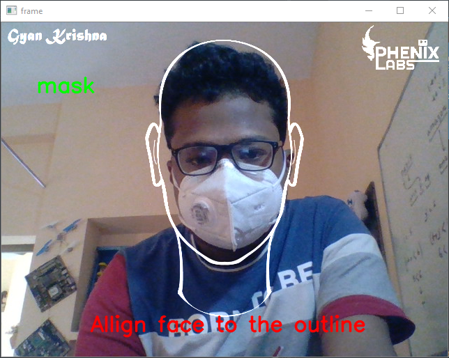
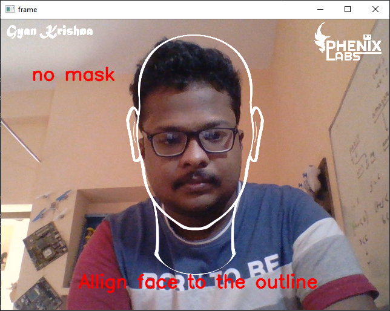
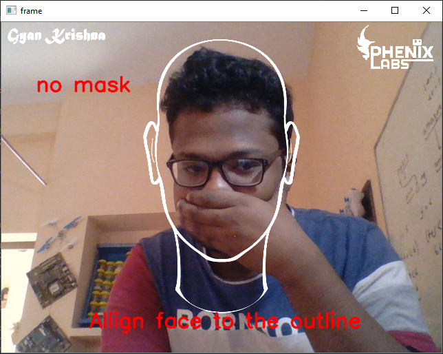

# Face Mask Detection
------------------------------------------------------------------------------------
## short descreption
This project detects if a person is wearing a face mask or not. it is based on tensor
flow and keras.

------------------------------------------------------------------------------------
## Screenshots:-

------------------------------------------------------------------------------------
## Prerequisite Libraries:-
1. tensorflow
2. numpy
3. matplotlib
4. os
------------------------------------------------------------------------------------
## to run the project:-
  1. open git bash
  2. Clone this project **git clone https://github.com/gyan-krishna/faceMaskDetection.git**
  3. python **faceMaskDetection/python testing.py**
  4. webcam will open and the program will run.
------------------------------------------------------------------------------------
## Developed and Maintained by
[👨 Gyan Krishna]() 
[📷 Insta](https://www.instagram.com/phenix_labs/) 
[🧳 LinkedIn](https://www.linkedin.com/in/gyan-krishna-8625a1158/)
